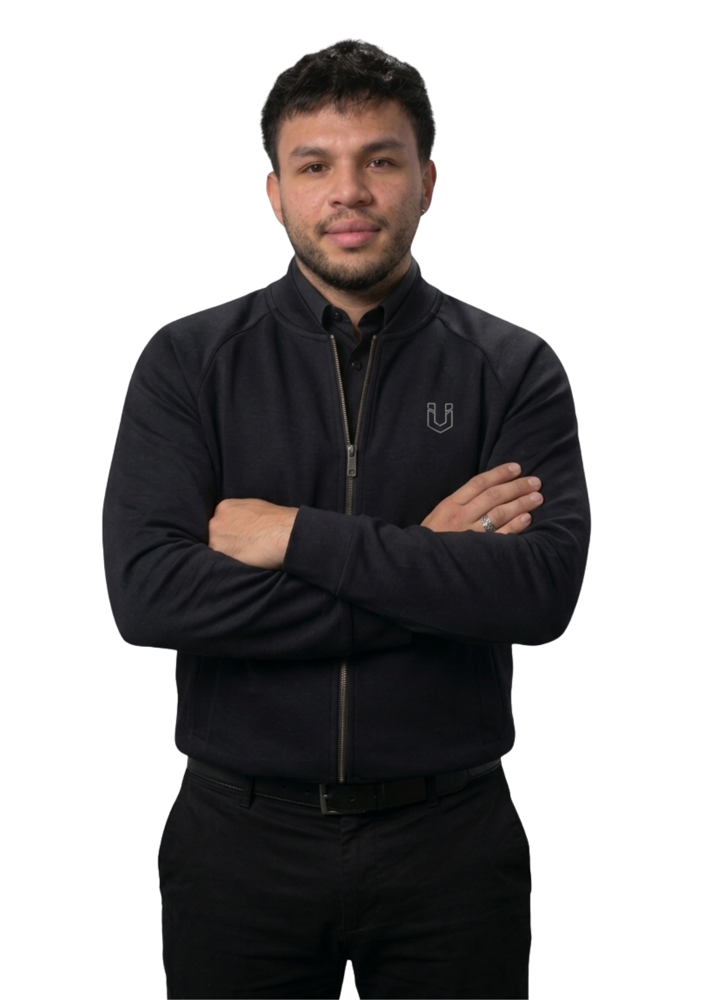
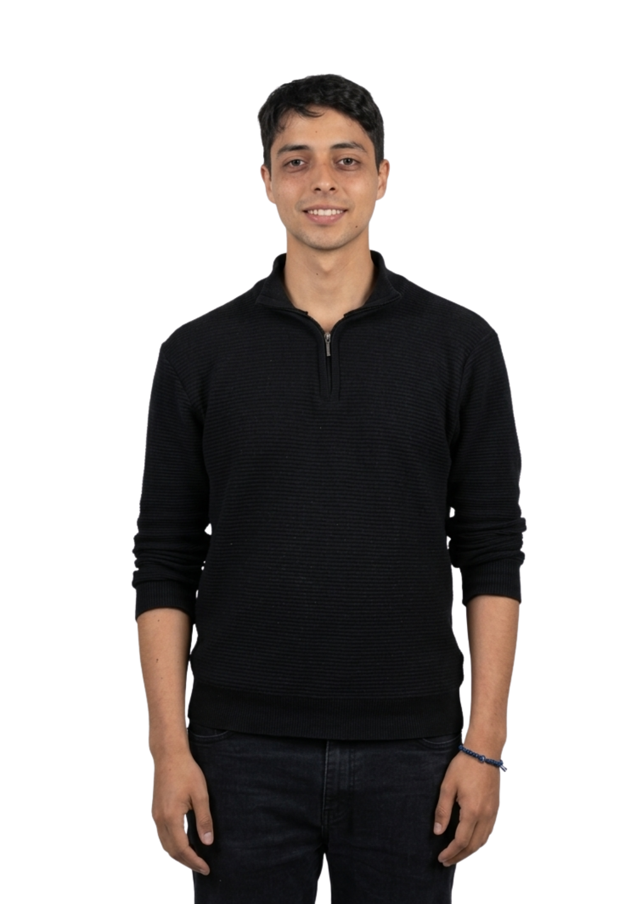
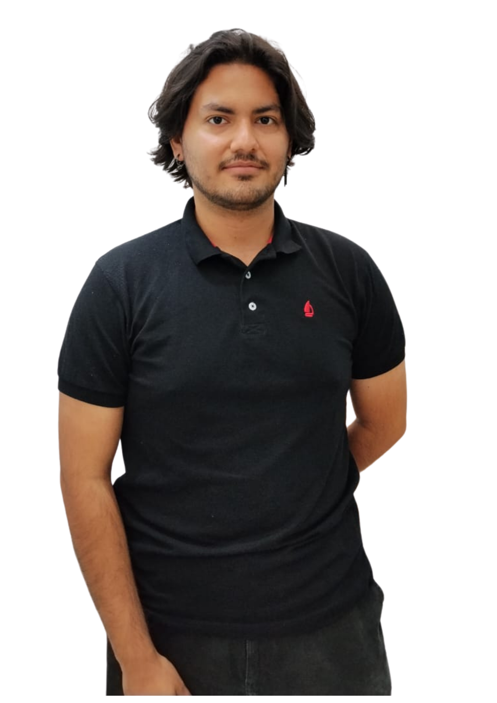

# Equipo ULogix — APM 2026-1

<table>
<tr>

<td align="center" width="200">
   
  <strong>Andrés Mauricio Morales Martínez</strong> 
  Arquitectura · ISA-95 · P&ID 
  <a href="https://github.com/mora200217">@mora200217</a>
</td>

<td align="center" width="200">
   
  <strong>Andrés Felipe Quenan Pozo</strong> 
  Robótica · RobotStudio 
  <a href="https://github.com/Andres-Felipe-Quenan">@Andres-Felipe-Quenan</a>
</td>

<td align="center" width="200">
   
  <strong>Juan José Díaz Guerrero</strong> 
  PLC · Grafcet · Ladder 
  <a href="https://github.com/Judiazgu">@Judiazgu</a>
</td>

<td align="center" width="200">
   
  <strong>Juan Manuel Beltrán Botello</strong> 
  NX · Digital Factory 
  <a href="https://github.com/JuanBeltran2024">@JuanBeltran2024</a>
</td>

</tr>
<tr>

<td align="center" width="200">
   
  <strong>Jorge Nicolas Garzón Acevedo</strong> 
  VSM · Proceso · OEE 
  <a href="https://github.com/Nicolas-Eule">@Nicolas-Eule</a>
</td>

<td align="center" width="200">
   
  <strong>Samuel David Sanchez Cardenas</strong> 
  Finanzas · EDT · GitHub · MES 
  <a href="https://github.com/samsanchezcar">@samsanchezcar</a>
</td>

<td align="center" width="200">
   
  <strong>Juan Felipe Triana Aguilera</strong> 
  SCADA · HMI · Ignition · Python 
  <a href="https://github.com/jutrianaa">@jutrianaa</a>
</td>

<td width="200"></td>

</tr>
</table>

## Roles y Supervisión

| Nombre | Rol técnico | Supervisa | Supervisado por |
|---|---|---|---|
| Andrés M. Morales | Arquitectura · ISA-95 · P&ID | A. Quenan | A. F. Quenan |
| Andrés F. Quenan | Robótica · RobotStudio | A. Morales | A. M. Morales |
| Juan J. Díaz | PLC · Grafcet · Ladder | J. Triana | J. F. Triana |
| Juan M. Beltrán | NX · Digital Factory | J. Garzón | S. D. Sanchez |
| Jorge N. Garzón | VSM · Proceso · OEE | S. Sanchez | J. M. Beltrán |
| **Samuel D. Sanchez** | **Finanzas · EDT · GitHub · MES** | J. Beltrán (NX/DF) | J. N. Garzón |
| Juan F. Triana | SCADA · HMI · Ignition · Python | J. Díaz | J. J. Díaz |

